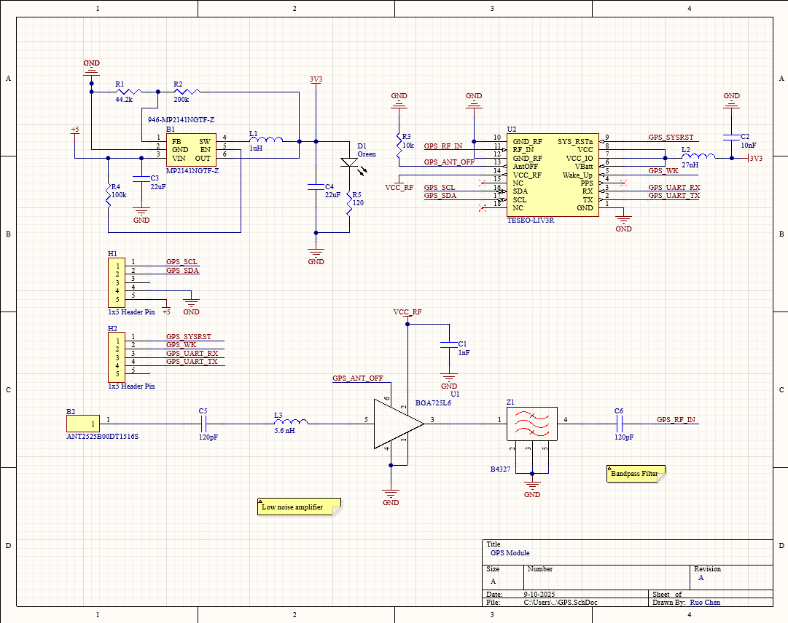
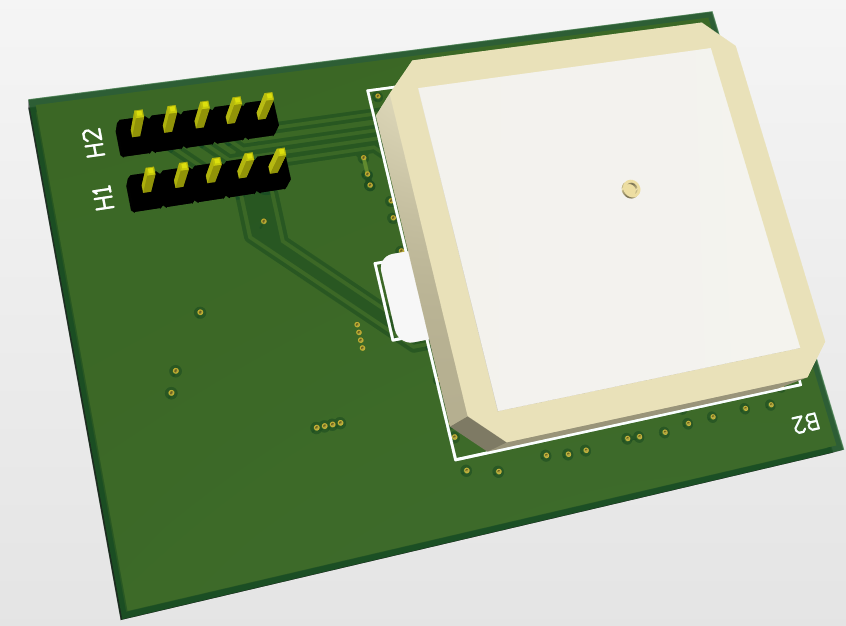
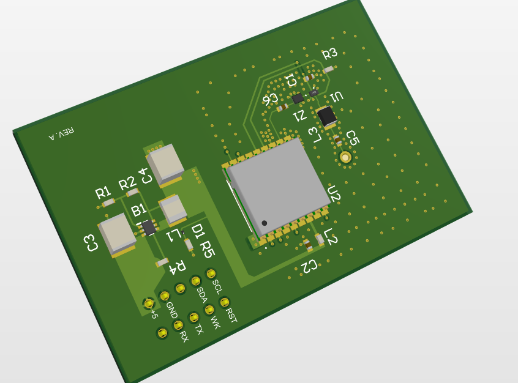

# GPS_Board
# Overview
This is my attempt at learning RF design related to PCBs. Features the Teseo-LIV3R GNSS receiver module and allows communication through i2c and UART.

This project is a custom-designed PCB created to receive L1 GPS signals. Signals from an antenna are fed through a low noise amplifier which is then filtered using a SAW RF with a center frequency of ~1575 MHz.

Created using Altium.

# Features
* L1 GPS receiver module

# Motivation
The goal of this project is to:
* Get feet wet with RF design, taking what I've learned about in classes and finding applications for them
* Build a reliable GPS board
* Eventual integration of GPS module into larger projects (such as robotics)

# Usage
The board is meant to be provided a +5V power source. This is fed into a buck converter with a 3V3 output to provide an efficient power source.

To communicate, the LIV3R publishes NMEA data packets. There are pins for UART and I2C communication with a logic analyzer or microcontroller. The LIV3R features internal pull-up resistors so external pull-ups are unnecessary for the I2C lines.

# Figures
## Schematic

## Top Side 3D

## Bottom Side 3D

# Future Improvements
I need to see if it actually works...

